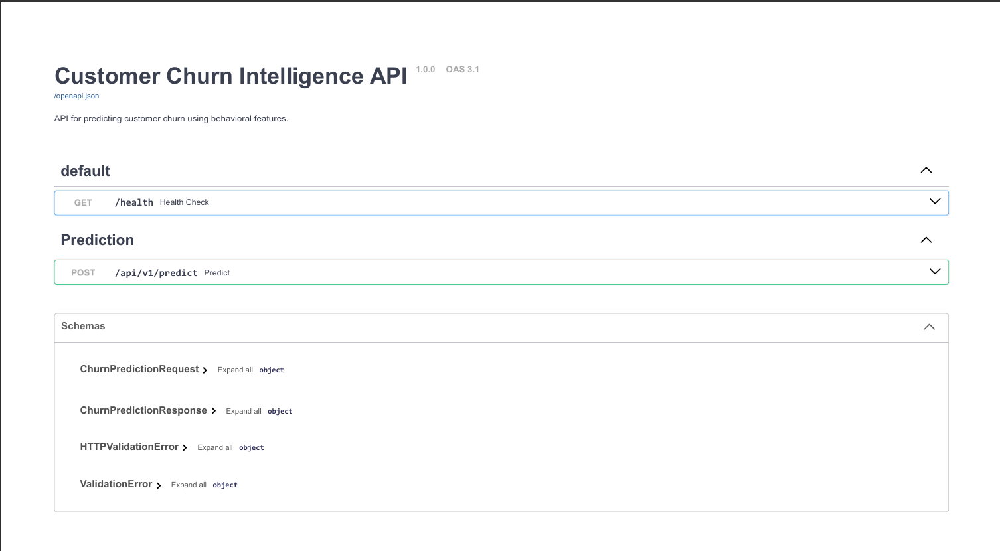
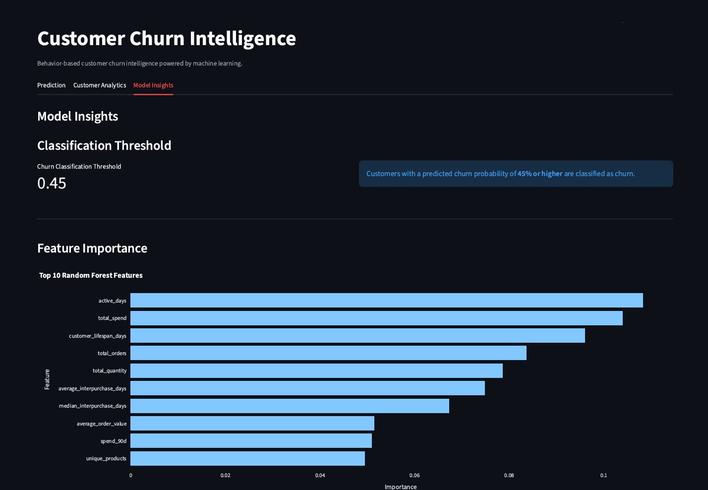

# Customer Churn Intelligence Platform


An end-to-end machine learning system for customer churn prediction using historical retail transaction data. The platform implements a complete workflow spanning data cleaning, temporal customer snapshot generation, behavioral feature engineering, model training and evaluation, prediction serving through FastAPI, and interactive analytics through Streamlit.

### Application Preview


## Project Overview

Customer churn is a business problem where identifying customers at risk of becoming inactive can support timely retention decisions. This project develops a machine learning system that uses historical retail transaction behavior to predict whether a customer is likely to churn within a defined future period.

The system follows a time-aware approach rather than treating transactions as independent observations. Historical transactions are cleaned and transformed into monthly customer snapshots, from which behavioral features such as recency, purchase frequency, spending patterns, customer lifespan, and purchase trends are derived.

A Random Forest classifier is trained using temporally ordered data and evaluated on a later unseen period. The resulting model is persisted as an artifact and exposed through a FastAPI REST service. A Streamlit dashboard provides an interactive interface for individual churn prediction, customer-level analytics, and model insights.

## Table of Contents

- [Project Overview](#project-overview)
- [Dataset & Data Preparation](#dataset--data-preparation)
- [Churn Definition & Temporal Snapshot Design](#churn-definition--temporal-snapshot-design)
- [Feature Engineering](#feature-engineering)
- [Exploratory Data Analysis](#exploratory-data-analysis)
- [Modeling & Evaluation](#modeling--evaluation)
- [Model Interpretability](#model-interpretability)
- [API & Application Architecture](#api--application-architecture)
- [Streamlit Dashboard](#streamlit-dashboard)
- [Project Structure](#project-structure)
- [Installation & Usage](#installation--usage)
- [Testing](#testing)
- [Limitations](#limitations)
- [Future Improvements](#future-improvements)
- [Technology Stack](#technology-stack)
- [Deployment](#deployment)
- [Dataset Attribution](#dataset-attribution)
- [License & Acknowledgements](#license--acknowledgements)


### Core Workflow

```text
Raw Transactions
       ↓
Data Cleaning & Validation
       ↓
Customer Snapshot Generation
       ↓
Behavioral Feature Engineering
       ↓
Churn Label Generation
       ↓
Temporal Model Training & Evaluation
       ↓
Persisted Model Artifact
       ↓
FastAPI Prediction Service
       ↓
Streamlit Analytics Dashboard
```

## Dataset & Data Preparation

The project uses the **Online Retail II** dataset from the UCI Machine Learning Repository. The dataset contains transaction-level records from a UK-based online retailer covering December 2009 through December 2011.

## Key Results

| Area | Result |
|---|---:|
| Clean transactions | 779,495 |
| Customer snapshots | 48,079 |
| Unique customers | 5,236 |
| Behavioral features | 20 |
| Test ROC-AUC | **0.7470** |
| Test PR-AUC | **0.6517** |
| Test Recall | **0.8630** |
| Test F1 Score | **0.6896** |
| Classification threshold | **0.45** |

## Technical Highlights

- Time-aware churn labeling using a 180-day observation window and 90-day prediction window.
- Monthly customer snapshots instead of transaction-level classification.
- Temporal train/validation/test splitting to reduce leakage from future observations.
- Validation-only threshold optimization with a held-out temporal test set.
- Behavioral feature engineering across recency, frequency, monetary value, and purchase trends.
- Persisted model artifact containing the model, feature schema, and classification threshold.
- FastAPI inference service separated from the Streamlit presentation layer.
- Automated tests covering model inference and API behavior.

### Dataset Characteristics

| Attribute | Value |
|---|---:|
| Raw records | 1,067,371 |
| Raw features | 8 |
| Cleaned records | 779,495 |
| Customers | 5,881 |
| Orders | 36,975 |
| Products | 4,631 |
| Countries | 41 |
| Missing values after cleaning | 0 |
| Exact duplicate rows after cleaning | 0 |

### Raw Features

The original transaction data contains:

- `Invoice`
- `StockCode`
- `Description`
- `Quantity`
- `InvoiceDate`
- `Price`
- `Customer ID`
- `Country`

These fields are normalized into a consistent internal schema before downstream processing.

### Data Cleaning

The preprocessing pipeline applies transaction-level validation and cleaning rules before customer-level feature generation.

Key processing steps include:

- Removing cancellation transactions.
- Removing operational adjustment records.
- Excluding transactions without a customer identifier.
- Removing records with invalid pricing or quantities for purchase-based analysis.
- Retaining customer-linked zero-price activity in the cleaned dataset while excluding it from purchase and revenue calculations.
- Removing exact duplicate transactions.
- Computing transaction-level revenue as:

```text
transaction_value = quantity × unit_price
```

## Churn Definition & Temporal Snapshot Design

Churn is defined using a forward-looking time window rather than a fixed transaction-level label. Customer behavior is observed over a historical period and used to determine whether the customer remains active during a subsequent prediction period.

### Observation and Prediction Windows

| Parameter | Definition |
|---|---|
| Observation window | 180 days |
| Prediction window | 90 days |
| Snapshot frequency | Monthly |
| Target | Future inactivity |

For each monthly snapshot date, the system examines the customer's qualifying purchase behavior during the preceding 180 days and uses this information to predict whether the customer will make a qualifying purchase during the following 90 days.

A customer is labeled as **churned (`churn = 1`)** when no qualifying purchase occurs during the 90-day prediction window. Otherwise, the customer is labeled as **non-churned (`churn = 0`)**.

### Qualifying Purchase

A transaction is considered a qualifying purchase when:

- A valid customer identifier is present.
- `quantity > 0`
- `unit_price > 0`
- The transaction is not a cancellation.
- The transaction is not an operational adjustment.

Zero-price activity is excluded from purchase-based churn calculations because it does not represent a revenue-generating purchase.

### Temporal Snapshot Generation

The snapshot generation process produces customer-level observations at monthly cutoff dates. Only cutoff dates with a complete 90-day future window are used, preventing incomplete future observations from affecting the target.

The resulting feature dataset contains:

- **48,079 customer snapshots**
- **5,236 unique customers**
- **24,491 churned snapshots**
- **23,588 non-churned snapshots**
- **50.94% snapshot-level churn rate**

This temporal formulation allows the model to learn from historical customer behavior while ensuring that the churn target is determined exclusively from future activity relative to each snapshot.


## Feature Engineering

Transaction-level records are transformed into customer-level behavioral features for each monthly observation snapshot. The feature engineering process captures customer engagement, monetary behavior, purchase recency, purchase frequency, and changes in purchasing behavior.

The final modeling dataset contains **20 behavioral features**.

### Transaction Value

For each qualifying transaction, monetary value is calculated as:

$$
\text{TransactionValue}_i
=
\text{Quantity}_i
\times
\text{UnitPrice}_i
$$

Customer-level spending is then obtained by aggregating transaction value over the observation window:

$$
\text{TotalSpend}_c
=
\sum_{i \in T_c}
\text{TransactionValue}_i
$$

where $T_c$ represents the qualifying transactions associated with customer $c$.

### Customer-Level Behavioral Features

| Feature | Definition |
|---|---|
| `total_orders` | Number of distinct orders during the observation window |
| `total_spend` | Sum of transaction values |
| `total_quantity` | Sum of purchased quantities |
| `unique_products` | Number of distinct products purchased |
| `active_days` | Number of distinct dates with purchase activity |
| `average_order_value` | Average spending per order |
| `customer_lifespan_days` | Days between first and most recent purchase |
| `recency_days` | Days between the snapshot date and most recent purchase |
| `average_interpurchase_days` | Mean interval between consecutive purchases |
| `median_interpurchase_days` | Median interval between consecutive purchases |

### Average Order Value

Average order value measures the average monetary value generated per order:

$$
\text{AOV}_c
=
\frac{\text{TotalSpend}_c}
{\text{TotalOrders}_c}
$$

This distinguishes customers who place many low-value orders from customers who place fewer high-value orders.

### Recency

Recency measures how recently a customer made a qualifying purchase relative to the snapshot date:

$$
\text{Recency}_c
=
t_{\text{snapshot}}
-
t_{\text{last purchase},c}
$$

A larger recency value indicates that the customer has been inactive for a longer period.

### Interpurchase Behavior

For a customer with purchase timestamps:

$$
t_1, t_2, \ldots, t_n
$$

the interpurchase intervals are:

$$
\Delta_i = t_i - t_{i-1}
$$

The average interpurchase interval is:

$$
\text{AvgInterpurchase}_c
=
\frac{1}{n-1}
\sum_{i=2}^{n}
\Delta_i
$$

The median interpurchase interval is also retained because purchase intervals can be highly skewed by irregular customer behavior.

### Recent Activity Features

Short-term behavioral features are calculated over multiple rolling periods:

- `orders_30d`
- `orders_60d`
- `orders_90d`
- `spend_30d`
- `spend_60d`
- `spend_90d`

For example:

$$
\text{Orders}_{30d,c}
=
\sum_{i \in W_{30}(c)}
\mathbf{1}(\text{transaction}_i \text{ belongs to customer } c)
$$

and:

$$
\text{Spend}_{90d,c}
=
\sum_{i \in W_{90}(c)}
\text{TransactionValue}_i
$$

where $W_k(c)$ represents the customer's qualifying transactions within the previous $k$ days.

These features capture recent engagement that may not be visible from lifetime aggregates alone.

### Previous-Period Features

To measure changes in behavior, activity from the previous 90-day period is calculated:

- `orders_previous_90d`
- `spend_previous_90d`

This creates a direct comparison between recent and preceding customer behavior.

### Trend Features

Order and spending trends are represented as ratios between the recent 90-day period and the preceding 90-day period.

For orders:

$$
\text{OrderTrendRatio}_c
=
\frac{\text{Orders}_{90d,c}}
{\max(1,\text{OrdersPrevious90d}_c)}
$$

For spending:

$$
\text{SpendTrendRatio}_c
=
\frac{\text{Spend}_{90d,c}}
{\max(1,\text{SpendPrevious90d}_c)}
$$

The denominator is protected against division by zero.

A ratio greater than 1 indicates higher recent activity relative to the preceding period, while a ratio below 1 indicates declining activity.

### Feature Engineering Principles

The pipeline follows strict temporal constraints:

1. Features use only transactions available before the snapshot date.
2. Future transactions are never used as model features.
3. Behavioral features are calculated within the 180-day observation window.
4. The churn target is calculated independently from the subsequent 90-day prediction window.
5. The same feature definitions are applied consistently across training, validation, and test periods.

This separation ensures that:

$$
\text{Features}
\leftarrow
\text{Past Behavior}
$$

while:

$$
\text{Target}
\leftarrow
\text{Future Behavior}
$$

This temporal separation is essential for preventing target leakage in churn prediction.

## Exploratory Data Analysis

Exploratory analysis was performed at the transaction, order, customer, product, geographic, and temporal levels to understand purchasing behavior and identify patterns relevant to churn prediction.

### Dataset Quality

After preprocessing, the final transaction dataset contains:

- **779,495** transaction records
- **5,881** unique customers
- **36,975** unique orders
- **4,631** unique products
- **41** countries
- **0** missing values
- **0** exact duplicate rows

The analysis also identified substantial skewness in several monetary and quantity-based variables.

| Feature | Skewness |
|---|---:|
| Quantity | ~396 |
| Unit Price | ~241 |
| Transaction Value | ~580 |

The extreme right-skew reflects a small number of unusually large transactions rather than necessarily representing erroneous observations. Consequently, the analysis avoided indiscriminate outlier removal and instead relied on transaction validation and business rules.

### Customer Purchase Behavior

Customer purchase intervals were highly variable:

| Statistic | Purchase Interval |
|---|---:|
| Mean | 51.68 days |
| Median | 24.74 days |
| 25th percentile | 6.98 days |
| 75th percentile | 61.80 days |
| Maximum | 714.15 days |

The difference between the mean and median indicates substantial variability in purchasing frequency across customers. Some customers purchase frequently, while others have long periods between transactions.

Customer purchase frequency also varied considerably:

- Minimum purchase days: **1**
- Maximum purchase days: **267**

This variation supports the use of recency and interpurchase behavior as important churn-related features.

### Customer Revenue Concentration

Revenue was strongly concentrated among a relatively small proportion of customers.

| Customer Segment | Revenue Contribution |
|---|---:|
| Top 1% | 31.93% |
| Top 5% | 52.01% |
| Top 10% | 63.93% |
| Top 20% | 77.25% |
| Top 50% | 93.58% |

This concentration indicates that customer value is highly heterogeneous. A relatively small group of customers accounts for a substantial share of total revenue.

### Customer-Level Relationships

Correlation analysis revealed several strong relationships between behavioral features:

| Feature Pair | Correlation |
|---|---:|
| Total Orders ↔ Active Days | 0.9685 |
| Total Spend ↔ Total Quantity | 0.8745 |
| Total Orders ↔ Unique Products | 0.6932 |
| Total Orders ↔ Total Spend | 0.6281 |
| Average Order Value ↔ Total Orders | 0.0338 |

The strong relationship between total orders and active days indicates that customers who purchase frequently tend to remain active across more days. Meanwhile, the weak relationship between average order value and order count suggests that order frequency and order value capture different aspects of customer behavior.

### Churn-Oriented Analysis

Customer recency was particularly relevant to churn analysis. At different recency thresholds, the proportion of customers remaining active decreased as the period since the last purchase increased.

The feature engineering stage therefore incorporates recency alongside purchase frequency, spending behavior, and changes in recent activity rather than relying on a single behavioral indicator.

### Temporal Considerations

The dataset ends on **9 December 2011**, making the final portion of the historical data an incomplete observation period for forward-looking analysis.

To avoid using incomplete future periods for churn labeling, only snapshot dates with a complete 90-day prediction window are included in the modeling dataset.

This resulted in **16 valid monthly snapshot cutoffs** spanning:

**June 2010 through September 2011.**

These EDA findings informed the subsequent feature engineering and temporal modeling strategy.

## Modeling & Evaluation

The modeling pipeline is designed as a time-aware binary classification workflow. Since churn prediction uses historical behavior to predict future inactivity, a random train/test split would risk allowing observations from later periods to influence the training process.

### Temporal Data Split

The feature dataset is divided chronologically into training, validation, and test periods.

| Split | Samples | Period |
|---|---:|---|
| Train | 34,104 | Jun 2010 – Apr 2011 |
| Validation | 5,708 | May 2011 – Jun 2011 |
| Test | 8,267 | Jul 2011 – Sep 2011 |

The model is trained only on earlier observations, while validation and test sets represent progressively later periods.

This setup provides a more realistic estimate of how the model may behave when predicting churn for future customer snapshots.

---

### Baseline Model — Logistic Regression

Logistic Regression was used as the baseline classifier because it provides a simple and interpretable reference point for the nonlinear Random Forest model.

For binary classification, Logistic Regression estimates the probability of churn using the sigmoid function:

$$
P(y=1\mid x)
=
\sigma(z)
=
\frac{1}{1+e^{-z}}
$$

where:

$$
z = \beta_0 + \sum_{j=1}^{p}\beta_j x_j
$$

The validation results at the default classification threshold of 0.50 were:

| Metric | Validation |
|---|---:|
| ROC-AUC | 0.7470 |
| Average Precision | 0.7075 |
| Accuracy | 0.6776 |
| Precision | 0.6372 |
| Recall | 0.8574 |
| F1 Score | 0.7311 |

The baseline established a reference point for evaluating the additional nonlinear modeling capacity of Random Forest.

---

### Random Forest

Random Forest was selected as the primary nonlinear model.

A Random Forest is an ensemble of decision trees. Each tree is trained using a bootstrap sample of the training data and considers a subset of features when splitting nodes.

For an input $x$, the ensemble aggregates the predictions of individual trees:

$$
\hat{P}(y=1\mid x)
=
\frac{1}{B}
\sum_{b=1}^{B}
P_b(y=1\mid x)
$$

where $B$ is the number of trees and $P_b$ represents the probability estimate from tree $b$.

The approach is well suited to this feature set because customer behavior contains nonlinear relationships and interactions between variables such as recency, spending, order frequency, and recent activity.

---

### Hyperparameter Tuning

A controlled set of Random Forest configurations was evaluated using the validation period.

The main hyperparameters investigated were:

- `max_depth`
- `min_samples_leaf`
- `n_estimators`
- `max_features`

The experiments focused on controlling tree complexity while maintaining sufficient model capacity.

| Configuration | ROC-AUC | PR-AUC | F1 |
|---|---:|---:|---:|
| Default / leaf 1 | 0.7684 | 0.7437 | 0.7260 |
| Depth 12 / leaf 2 | 0.7672 | 0.7315 | **0.7396** |
| Depth 16 / leaf 2 | **0.7688** | 0.7367 | 0.7392 |
| Depth 20 / leaf 2 | 0.7687 | 0.7394 | 0.7371 |
| Depth 16 / leaf 4 | 0.7657 | 0.7337 | 0.7396 |

The depth-12 configuration with a minimum leaf size of 2 was selected for the final model based on the validation results and the objective of maintaining a balanced precision-recall trade-off while controlling tree complexity.

### Final Random Forest Configuration

```python
MODEL_CONFIG = {
    "n_estimators": 300,
    "max_depth": 12,
    "min_samples_leaf": 2,
    "max_features": "sqrt",
    "random_state": 42,
    "n_jobs": -1,
}
```

### Classification Threshold Selection

The Random Forest outputs a probability of churn rather than a direct binary class. A classification threshold is therefore required to convert the predicted probability into the final churn decision.

For a predicted churn probability $p$ and threshold $t$:

$$
\hat{y}
=
\begin{cases}
1 & \text{if } p \geq t \\
0 & \text{otherwise}
\end{cases}
$$

Rather than using the conventional threshold of 0.50, multiple thresholds were evaluated on the validation set.

| Threshold | F1 Score |
|---:|---:|
| 0.30 | 0.7379 |
| 0.35 | 0.7400 |
| 0.40 | 0.7450 |
| **0.45** | **0.7457** |
| 0.50 | 0.7396 |
| 0.55 | 0.7309 |
| 0.60 | 0.7146 |
| 0.65 | 0.6786 |
| 0.70 | 0.5580 |

A threshold of **0.45** was selected based on validation-set F1 performance and the desired balance between precision and recall.

The selected threshold was then fixed before evaluating the model on the held-out test period.

---

### Final Test Evaluation

The final Random Forest was evaluated on the temporally held-out test set using the selected classification threshold of **0.45**.

| Metric | Test Result |
|---|---:|
| ROC-AUC | **0.7470** |
| PR-AUC | **0.6517** |
| Average Precision | **0.6519** |
| Accuracy | **0.6591** |
| Precision | **0.5743** |
| Recall | **0.8630** |
| F1 Score | **0.6896** |

The test set contains a churn rate of **43.89%**.

The difference between validation and test performance reflects the temporal nature of the problem: the model is evaluated on a later period that was not available during model selection or threshold tuning.

---

### Confusion Matrix

Using the 0.45 classification threshold, the test-set confusion matrix is:

$$
\begin{bmatrix}
2318 & 2321 \\
497 & 3131
\end{bmatrix}
$$

where rows represent the actual class and columns represent the predicted class.

| | Predicted Non-Churn | Predicted Churn |
|---|---:|---:|
| **Actual Non-Churn** | 2,318 | 2,321 |
| **Actual Churn** | 497 | 3,131 |

The corresponding classification metrics are derived from:

$$
\text{Precision}
=
\frac{TP}{TP+FP}
$$

$$
\text{Recall}
=
\frac{TP}{TP+FN}
$$

$$
\text{F1}
=
2
\cdot
\frac{\text{Precision}\cdot\text{Recall}}
{\text{Precision}+\text{Recall}}
$$

The model achieves a recall of **86.30%**, identifying a large proportion of churned customer snapshots, while the precision of **57.43%** indicates that a meaningful proportion of predicted churn cases are false positives.

---

### Model Selection Workflow

The complete modeling process follows a sequential evaluation strategy:

```text
Temporal Feature Dataset
        ↓
Logistic Regression Baseline
        ↓
Random Forest Candidate Configurations
        ↓
Validation-Based Hyperparameter Evaluation
        ↓
Classification Threshold Analysis
        ↓
Final Random Forest + 0.45 Threshold
        ↓
Held-Out Temporal Test Evaluation
```
The test set was not used during hyperparameter selection or threshold optimization. It was reserved for the final evaluation of the selected modeling pipeline.

This separation provides a more reliable estimate of temporal generalization and reduces the risk of overestimating model performance through repeated evaluation on the same test data.


## Model Interpretability

Model interpretability is provided through Random Forest feature importance. The importance values are extracted directly from the persisted model artifact used by the prediction service, ensuring that the dashboard reflects the same model used for inference.

### Feature Importance

The final Random Forest ranks features based on their contribution to reducing impurity across the decision trees.

For a decision node $t$, the impurity decrease associated with a split can be expressed as:

$$
\Delta I
=
I(t)
-
\frac{N_L}{N_t}I(L)
-
\frac{N_R}{N_t}I(R)
$$

where:

- $I(t)$ is the impurity of the parent node.
- $I(L)$ and $I(R)$ are the impurities of the left and right child nodes.
- $N_t$ is the number of samples reaching the parent node.
- $N_L$ and $N_R$ are the numbers of samples reaching the respective child nodes.

The Random Forest aggregates these impurity reductions across all trees to calculate the feature importance values.

### Most Important Features

The final model identifies the following features among the most influential predictors:

| Feature | Importance |
|---|---:|
| `total_quantity` | 0.1112 |
| `total_spend` | 0.1107 |
| `average_order_value` | 0.0911 |
| `unique_products` | 0.0873 |
| `recency_days` | 0.0864 |
| `spend_previous_90d` | 0.0619 |
| `spend_90d` | 0.0567 |
| `customer_lifespan_days` | 0.0551 |
| `spend_trend_ratio` | 0.0535 |
| `average_interpurchase_days` | 0.0534 |

The importance distribution indicates that the model relies heavily on measures of customer purchasing volume, monetary behavior, product diversity, recency, and changes in spending activity.

### Interpretation

Several behavioral dimensions appear repeatedly among the most influential features:

- **Purchase volume:** `total_quantity` captures the overall quantity purchased by a customer.
- **Monetary behavior:** `total_spend` and `average_order_value` capture customer value and purchasing intensity.
- **Engagement breadth:** `unique_products` reflects the diversity of products purchased.
- **Recency:** `recency_days` captures how long the customer has been inactive relative to the snapshot date.
- **Recent behavioral change:** `spend_previous_90d`, `spend_90d`, and `spend_trend_ratio` capture changes in spending activity over time.
- **Purchase cadence:** `average_interpurchase_days` provides information about the customer's typical purchasing interval.

### Important Limitation

Random Forest feature importance describes how the trained model uses the available features. It does **not** establish that a feature causes customer churn.

In addition, correlated features can distribute importance across multiple variables. For example, total orders, active days, and purchase frequency measure related aspects of customer engagement.

Therefore, feature importance is used as a model interpretation tool rather than as causal evidence about customer behavior.

### Dashboard Integration

The Streamlit dashboard exposes the model's classification threshold and top feature importance values through the **Model Insights** section.

The dashboard loads these values directly from the persisted model artifact, keeping the displayed model information consistent with the deployed prediction pipeline.

## API & Application Architecture

The trained model is integrated into an application architecture that separates model inference, API serving, and user-facing analytics.

```text
                        ┌──────────────────────┐
                        │   Streamlit Dashboard │
                        │                      │
                        │ • Prediction         │
                        │ • Customer Analytics │
                        │ • Model Insights     │
                        └──────────┬───────────┘
                                   │
                              HTTP / JSON
                                   │
                                   ▼
                        ┌──────────────────────┐
                        │      FastAPI         │
                        │                      │
                        │  POST /api/v1/predict│
                        │  GET  /health        │
                        └──────────┬───────────┘
                                   │
                                   ▼
                        ┌──────────────────────┐
                        │ Prediction Pipeline  │
                        │                      │
                        │ • Input validation   │
                        │ • Feature ordering   │
                        │ • Probability        │
                        │ • Classification     │
                        │ • Risk categorization│
                        └──────────┬───────────┘
                                   │
                                   ▼
                        ┌──────────────────────┐
                        │ Persisted Random     │
                        │ Forest Artifact      │
                        │                      │
                        │ random_forest.joblib │
                        └──────────────────────┘
```
### FastAPI Prediction Service

The backend is implemented using **FastAPI** and exposes the trained churn model through a REST API. This separates model inference from the dashboard and allows the same prediction service to be consumed by other applications or clients.

### API Documentation

FastAPI provides interactive Swagger documentation for testing the prediction service.

  

#### Available Endpoints

| Method | Endpoint | Purpose |
|---|---|---|
| `GET` | `/health` | Verify that the API service is running |
| `POST` | `/api/v1/predict` | Generate a customer churn prediction |
| `GET` | `/docs` | Interactive Swagger API documentation |

### Prediction Request

The `/api/v1/predict` endpoint accepts the 20 behavioral features required by the trained Random Forest model.

Example request:

```json
{
  "total_orders": 8,
  "total_spend": 1250.50,
  "total_quantity": 420,
  "unique_products": 35,
  "active_days": 18,
  "average_order_value": 156.31,
  "customer_lifespan_days": 240,
  "recency_days": 18,
  "average_interpurchase_days": 31.5,
  "median_interpurchase_days": 27.0,
  "orders_30d": 2,
  "orders_60d": 4,
  "orders_90d": 6,
  "spend_30d": 310.50,
  "spend_60d": 620.25,
  "spend_90d": 910.75,
  "orders_previous_90d": 9,
  "spend_previous_90d": 1350.00,
  "order_trend_ratio": 0.67,
  "spend_trend_ratio": 0.67
}
```

The request is validated using **Pydantic** before reaching the model inference layer. This ensures that required features are present, have the expected data types, and satisfy the defined validation constraints.

### Prediction Response

After validation, the request is passed to the prediction pipeline, which loads the persisted Random Forest model and generates a churn probability.

Example response:

```json
{
  "churn_probability": 0.73,
  "churn_prediction": 1,
  "risk_level": "high"
}
```

The response contains three outputs:

| Field | Description |
|---|---|
| `churn_probability` | Predicted probability of customer churn |
| `churn_prediction` | Binary churn classification (`0` or `1`) |
| `risk_level` | Application-level risk category |

The predicted probability is converted into a binary classification using the threshold selected during validation:

$$
\hat{y}
=
\begin{cases}
1 & \text{if } p \geq 0.45 \\
0 & \text{otherwise}
\end{cases}
$$

where $p$ represents the predicted probability of churn.

The threshold of **0.45** is stored together with the model artifact so that the same classification rule is consistently applied during inference.

### Request Validation

The API uses **Pydantic** schemas to validate incoming prediction requests before they reach the machine learning model.

Validation includes:

- Required feature fields.
- Numeric data type validation.
- Non-negative constraints for applicable behavioral features.
- Response schema validation.

This prevents malformed requests from being passed directly to the model.

### Prediction Pipeline

The complete request-to-prediction flow is:

```text
Client Request
      ↓
Pydantic Validation
      ↓
Feature Dictionary
      ↓
Feature Validation
      ↓
Feature Ordering
      ↓
Random Forest predict_proba()
      ↓
Apply Classification Threshold
      ↓
Churn Prediction
      ↓
Risk Categorization
      ↓
JSON Response
```

The API route is intentionally kept lightweight. HTTP handling and request validation remain in the API layer, while model loading and inference logic are handled by the dedicated prediction module.

### Persisted Model Artifact

The trained Random Forest model is persisted using `joblib`:

```text
artifacts/
└── random_forest.joblib
```

The saved artifact contains the trained model, expected feature ordering, and classification threshold:

```python
{
    "model": model,
    "feature_columns": feature_columns,
    "threshold": 0.45
}
```

Storing the feature schema alongside the model prevents feature-order mismatches between training and inference.

### Risk Categorization

The prediction service maps the predicted churn probability into application-level risk categories:

| Churn Probability | Risk Level |
|---:|---|
| `< 0.45` | Low |
| `0.45 – < 0.70` | Medium |
| `≥ 0.70` | High |

These categories are intended to simplify interpretation within the application. They are **not calibrated probability bands** or causal assessments of customer risk.

### Streamlit Integration

The Streamlit dashboard communicates with the FastAPI backend through HTTP requests rather than directly executing the model.

The prediction workflow is:

```text
User Input
    ↓
Streamlit Dashboard
    ↓
HTTP POST /api/v1/predict
    ↓
FastAPI
    ↓
Prediction Pipeline
    ↓
Random Forest
    ↓
JSON Response
    ↓
Dashboard Visualization
```

This separation allows the model inference layer to operate independently from the user interface and makes the prediction API reusable by other clients.

### API Documentation

FastAPI automatically generates interactive API documentation using OpenAPI.

The Swagger UI is available at:

```text
http://127.0.0.1:8000/docs
```

The documentation can be used to inspect the request and response schemas and manually test the prediction endpoint.

### Service Configuration

The Streamlit dashboard obtains the backend API address from an environment variable:

```env
API_BASE_URL=http://127.0.0.1:8000
```

Keeping the API address outside the application code allows the dashboard to communicate with different backend environments without modifying the application source code.

### Application Layers

The application is organized into three logical layers:

```text
Presentation Layer
        │
        ▼
Streamlit Dashboard
        │
        │ HTTP / JSON
        ▼
Service Layer
        │
        ▼
FastAPI REST API
        │
        ▼
ML Inference Layer
        │
        ▼
Persisted Random Forest
```

The responsibilities of each layer are:

- **Streamlit Dashboard** — Handles user interaction, input collection, visualization, and presentation of prediction results.
- **FastAPI Service** — Handles HTTP requests, request validation, routing, and structured API responses.
- **Prediction Pipeline** — Handles model loading, feature validation, inference, classification, and risk categorization.
- **Random Forest Artifact** — Stores the trained model, expected feature schema, and classification threshold.

This separation keeps the user interface, API service, and machine learning inference logic independently structured while allowing them to operate together as a single churn prediction platform.

## Streamlit Dashboard

The project includes an interactive **Streamlit dashboard** that provides a user-facing interface for churn prediction, customer analytics, and model interpretation.

The dashboard communicates with the FastAPI backend through HTTP requests, keeping the presentation layer separate from the machine learning inference service.

### Dashboard Sections

The dashboard is organized into three primary sections:

#### 1. Prediction

The **Prediction** section allows users to enter the behavioral features of an individual customer and obtain a churn prediction through the FastAPI service.

### Prediction Interface


The interface displays:

- Churn probability
- Binary churn prediction
- Risk level
- Interactive churn probability gauge

The prediction is generated by the same persisted Random Forest model exposed through the API.

```text
Customer Features
       ↓
Streamlit Input Form
       ↓
FastAPI Prediction API
       ↓
Random Forest Model
       ↓
Prediction Response
       ↓
Probability + Prediction + Risk Level
```

#### 2. Customer Analytics

The **Customer Analytics** section provides an exploratory view of the engineered customer snapshot dataset.

### Customer Analytics


The dashboard displays key dataset metrics including:

- Unique customers
- Customer snapshots
- Snapshot-level churn rate
- Average customer spend

Interactive visualizations include:

- Churn distribution
- Recency distribution by churn status
- Customer spending distribution
- Orders versus spending
- Monthly churn rate trend

The analytics are based on the generated customer snapshots rather than raw transaction records.

Because a customer can appear in multiple monthly snapshots, the snapshot-level observations should not be interpreted as a count of unique customers.

#### 3. Model Insights

The **Model Insights** section provides visibility into the deployed model configuration and feature importance.

### Model Insights



It displays:

- Classification threshold
- Top Random Forest features
- Feature importance visualization

The classification threshold used by the dashboard is loaded directly from the persisted model artifact.

The feature importance visualization is generated from the same saved Random Forest model used for prediction, ensuring consistency between model analysis and deployed inference.

### Interactive Visualizations

The dashboard uses **Plotly** for interactive visualizations.

Examples include:

- Bar charts for churn distribution
- Box plots for customer recency
- Histograms for spending behavior
- Scatter plots for order and spending relationships
- Line charts for temporal churn trends
- Gauge visualization for individual churn probability

The charts are implemented as reusable functions in:

```text
dashboard/components/charts.py
```

This separates visualization construction from dashboard rendering logic and makes the individual chart components easier to maintain and test.

### Dashboard Architecture

The Streamlit application follows a component-based structure:

```text
dashboard/
├── app.py
├── dashboard_config.py
├── services/
│   └── api.py
└── components/
    ├── inputs.py
    ├── prediction.py
    ├── analytics.py
    ├── charts.py
    └── model_insights.py
```

The responsibilities are separated as follows:

| Component | Responsibility |
|---|---|
| `app.py` | Dashboard entry point and page structure |
| `inputs.py` | Customer feature input interface |
| `prediction.py` | Prediction result presentation |
| `analytics.py` | Customer analytics and data preparation |
| `charts.py` | Reusable Plotly chart functions |
| `model_insights.py` | Model threshold and feature importance |
| `services/api.py` | Communication with the FastAPI backend |
| `dashboard_config.py` | Dashboard configuration |

### Performance Considerations

The feature dataset used for customer analytics is loaded using Streamlit's caching mechanism.

```python
@st.cache_data
def load_feature_data():
    ...
```

Caching prevents the same dataset from being repeatedly loaded and processed during Streamlit reruns, improving dashboard responsiveness.

The dashboard also limits the number of observations used for computationally heavier visualizations such as the orders-versus-spend scatter plot.

### Configuration

The dashboard obtains the FastAPI backend URL from an environment variable:

```env
API_BASE_URL=http://127.0.0.1:8000
```

This allows the frontend and backend services to be configured independently across development and deployment environments.

### User Flow

The complete dashboard workflow is:

```text
Open Streamlit Dashboard
          ↓
    Select Dashboard Tab
          ↓
 ┌────────┼───────────────┐
 ↓        ↓               ↓
Prediction Analytics  Model Insights
 ↓        ↓               ↓
API      Feature Data    Saved Model
 ↓        ↓               ↓
Result   Charts          Importance
```

The dashboard therefore acts as the presentation layer of the platform while the FastAPI service remains responsible for model inference.

## Project Structure

The project follows a modular structure that separates data processing, feature engineering, model development, API serving, and dashboard components.

```text
customer-churn-intelligence-platform/
│
├── artifacts/
│   └── random_forest.joblib
│
├── config/
│   ├── __init__.py
│   └── settings.py
│
├── data/
│   ├── raw/
│   └── processed/
│       ├── cleaned_retail_data.csv
│       ├── customer_churn_features.csv
│       ├── train.csv
│       ├── validation.csv
│       └── test.csv
│
├── dashboard/
│   ├── __init__.py
│   ├── app.py
│   ├── dashboard_config.py
│   ├── services/
│   │   ├── __init__.py
│   │   └── api.py
│   └── components/
│       ├── __init__.py
│       ├── inputs.py
│       ├── prediction.py
│       ├── analytics.py
│       ├── charts.py
│       └── model_insights.py
│
├── notebooks/
│   └── ...
│
├── src/
│   ├── api/
│   │   ├── __init__.py
│   │   ├── main.py
│   │   ├── schemas.py
│   │   └── routes/
│   │       ├── __init__.py
│   │       └── prediction.py
│   │
│   ├── data/
│   │   ├── cleaning.py
│   │   └── validation.py
│   │
│   ├── features/
│   │   ├── engineering.py
│   │   └── snapshots.py
│   │
│   ├── model/
│   │   ├── evaluate.py
│   │   ├── importance.py
│   │   ├── load_model.py
│   │   ├── predict.py
│   │   ├── save_model.py
│   │   └── train.py
│   │
│   └── pipelines/
│       └── ...
│
├── tests/
│   ├── api/
│   │   └── test_prediction.py
│   ├── data/
│   ├── features/
│   └── model/
│       └── test_predict.py
│
├── .gitignore
├── README.md
└── requirements.txt
```
## Directory	Responsibility
```
artifacts/	Stores persisted machine learning model artifacts
config/	Centralizes project configuration and file paths
data/raw/	Stores original source data
data/processed/	Stores cleaned datasets, engineered features, and temporal splits
dashboard/	Contains the Streamlit user interface and visualization components
notebooks/	Contains exploratory analysis and experimentation notebooks
src/api/	Implements the FastAPI application and prediction endpoints
src/data/	Handles data cleaning and validation
src/features/	Generates temporal customer snapshots and behavioral features
src/model/	Handles model training, evaluation, persistence, inference, and interpretation
src/pipelines/	Contains higher-level workflows connecting project stages
tests/	Contains automated tests for the data, feature, model, and API layers
Separation of Responsibilities
```

The project intentionally separates experimentation from reusable application code.

Notebooks are used for exploration, visualization, and experimentation.
```
src/ contains reusable Python modules used by the actual pipeline and application.
tests/ verifies the behavior of individual components.
dashboard/ contains presentation and visualization logic.
artifacts/ contains the model required for inference.
```

This structure makes it possible to move from exploratory analysis to a reusable machine learning application without placing the entire workflow inside notebooks.

## Installation & Usage

### Prerequisites

The project requires:

- Python 3.11+
- Git
- A virtual environment
- PowerShell, Command Prompt, or an equivalent terminal

### Clone the Repository

```bash
git clone <repository-url>
cd customer-churn-intelligence-platform
```

### Create a Virtual Environment

Create and activate a Python virtual environment:

```powershell
py -3.11 -m venv .venv
.\.venv\Scripts\Activate.ps1
```

If PowerShell execution policies prevent activation, the environment can also be used directly through its Python executable.

### Install Dependencies

Install the required packages:

```powershell
python -m pip install --upgrade pip
pip install -r requirements.txt
```

### Start the FastAPI Backend

From the project root, start the API server using Uvicorn:

```powershell
uvicorn src.api.main:app --reload
```

The API will be available at:

```text
http://127.0.0.1:8000
```

The interactive API documentation is available at:

```text
http://127.0.0.1:8000/docs
```

The health endpoint can be used to verify that the API service is running:

```text
http://127.0.0.1:8000/health
```

### Start the Streamlit Dashboard

The dashboard communicates with the FastAPI backend, so the API should be running before starting Streamlit.

From the project root:

```powershell
$env:PYTHONPATH = (Get-Location).Path
streamlit run dashboard/app.py
```

The dashboard will be available at the local Streamlit URL displayed in the terminal.

The dashboard uses the following environment variable to locate the FastAPI service:

```env
API_BASE_URL=http://127.0.0.1:8000
```

### Running the Application

The complete local application requires two processes.

**Terminal 1 — FastAPI**

```powershell
uvicorn src.api.main:app --reload
```

**Terminal 2 — Streamlit**

```powershell
$env:PYTHONPATH = (Get-Location).Path
streamlit run dashboard/app.py
```

The resulting application flow is:

```text
                 ┌─────────────────────┐
                 │ Streamlit Dashboard │
                 │   localhost:8501    │
                 └──────────┬──────────┘
                            │
                       HTTP / JSON
                            │
                            ▼
                 ┌─────────────────────┐
                 │     FastAPI API     │
                 │   localhost:8000    │
                 └──────────┬──────────┘
                            │
                            ▼
                 ┌─────────────────────┐
                 │ Persisted Random    │
                 │ Forest Model        │
                 └─────────────────────┘
```

### Running the Test Suite

Run the complete automated test suite using:

```powershell
py -m pytest
```

For more detailed test output:

```powershell
py -m pytest -v
```

The test suite covers the project's core components, including:

- Data processing
- Feature engineering
- Model inference
- API endpoints
- Request validation

### Model Artifact

The trained model artifact is stored at:

```text
artifacts/
└── random_forest.joblib
```

The artifact contains:

- The trained Random Forest model
- The expected feature schema
- The classification threshold

These components are required by the prediction pipeline during inference.

If the model artifact needs to be regenerated, the model training and persistence modules under `src/model/` can be used with the processed feature dataset.

### Typical Development Workflow

A typical local workflow is:

```text
Clone Repository
      ↓
Create Virtual Environment
      ↓
Install Dependencies
      ↓
Prepare / Verify Processed Data
      ↓
Verify Model Artifact
      ↓
Start FastAPI
      ↓
Start Streamlit
      ↓
Run Automated Tests
```

This setup allows the complete machine learning application to run locally with the model, API, and dashboard separated into independent application layers.


## Testing

The project includes automated tests covering the core machine learning and application layers. The test suite is designed to verify individual components as well as the API prediction workflow.

### Test Coverage

The current test structure is organized by application layer:

```text
tests/
├── api/
│   └── test_prediction.py
├── data/
├── features/
└── model/
    └── test_predict.py
```

### API Tests

The API tests verify the FastAPI application and prediction endpoint, including:

- Health endpoint availability.
- Successful prediction requests.
- Response schema validation.
- Invalid request handling.

The API tests use FastAPI's testing utilities to exercise the endpoints without requiring a separate running server.

### Model Tests

The model tests verify the prediction layer independently from the API.

The tests cover:

- Loading the persisted model artifact.
- Required feature validation.
- Probability generation.
- Binary churn classification.
- Risk-level assignment.

This ensures that model inference behaves consistently before it is exposed through the REST API.

### Running Tests

Run the complete test suite from the project root:

```powershell
py -m pytest
```

For verbose output:

```powershell
py -m pytest -v
```

Individual test modules can also be executed separately:

```powershell
py -m pytest tests/model/test_predict.py
```

```powershell
py -m pytest tests/api/test_prediction.py
```

### Testing Strategy

The project uses a layered testing approach:

```text
Data / Feature Components
          ↓
    Model Inference
          ↓
      API Layer
          ↓
   Dashboard Integration
```

Lower-level model behavior is tested independently from HTTP behavior, while API tests verify that the inference layer is correctly exposed through the REST interface.

This separation makes failures easier to isolate and reduces the risk of introducing changes in one layer that silently break another.

### Validation Before Deployment

Before running the application in a new environment, the following checks should be performed:

```text
Dependencies Installed
        ↓
Model Artifact Available
        ↓
Automated Tests Pass
        ↓
FastAPI Health Check
        ↓
Prediction Endpoint Verified
        ↓
Streamlit Dashboard Verified
```

The test suite therefore serves as a basic regression check for the project's data science and application components.


## Limitations

Despite the temporal design and end-to-end application architecture, the project has several limitations that should be considered when interpreting the results.

### Dataset Limitations

The model is trained on historical transaction data from a single online retailer. The purchasing patterns observed in this dataset may not represent customer behavior in other industries, regions, or business models.

The dataset also ends on **9 December 2011**, so the model should not be interpreted as a representation of current retail behavior.

### Churn Definition

Churn is defined as the absence of a qualifying purchase during the 90-day prediction window.

This is an operational definition rather than a universally applicable definition of customer churn. Different businesses may require different inactivity periods depending on their normal purchasing cycle.

### Temporal Generalization

The model is evaluated using a later temporal test period rather than a randomly sampled test set. This better reflects the intended prediction scenario, but it also exposes the model to changes in customer behavior over time.

The observed test performance is therefore specific to the historical period represented by the dataset.

### Class Probability Interpretation

The Random Forest produces estimated churn probabilities, but these probabilities have not been explicitly calibrated.

Therefore, a prediction such as `0.70` should be interpreted as a model score indicating a relatively high estimated likelihood under the learned model, rather than as a guaranteed 70% real-world probability.

### Feature Importance

The model uses impurity-based Random Forest feature importance for interpretation.

Feature importance does not establish causality. Furthermore, correlated behavioral variables can distribute importance across multiple features, making individual importance values difficult to interpret as independent effects.

### Risk Categories

The dashboard maps predicted probabilities into Low, Medium, and High risk categories using application-defined thresholds.

These categories are intended for visualization and interpretation and are not validated business risk segments.

### Production Considerations

The current project demonstrates an end-to-end machine learning application but does not implement several components that would normally be required for a production system, including:

- Automated model retraining.
- Continuous data ingestion.
- Model performance monitoring.
- Data drift detection.
- Prediction logging and audit trails.
- Centralized application logging.
- Authentication and authorization.
- Rate limiting.
- Production-grade secret management.
- Container orchestration and autoscaling.

These limitations define the boundary between the current portfolio implementation and a fully operational production machine learning system.

## Future Improvements

The current implementation provides a complete end-to-end churn prediction workflow. The following improvements could extend the system toward a more robust production machine learning platform.

### Data & Feature Engineering

- Integrate automated transaction ingestion instead of relying on static datasets.
- Add automated data quality checks for schema changes, missing values, duplicates, and unexpected distributions.
- Introduce additional behavioral features such as customer monetary contribution, product-category preferences, and customer-level purchase diversity.
- Evaluate alternative observation and prediction windows based on business-specific purchasing cycles.

### Model Development

- Evaluate additional algorithms such as Gradient Boosting, XGBoost, LightGBM, and calibrated ensemble models.
- Perform systematic hyperparameter optimization using cross-validation strategies that respect temporal ordering.
- Evaluate probability calibration using methods such as Platt scaling or isotonic regression.
- Investigate explainability methods such as SHAP for local and global model explanations.
- Evaluate model performance across different customer segments and time periods.

### MLOps & Monitoring

A production deployment could introduce an automated model lifecycle:

```text
Data Ingestion
      ↓
Data Validation
      ↓
Feature Generation
      ↓
Model Training
      ↓
Model Evaluation
      ↓
Model Registration
      ↓
Deployment
      ↓
Prediction Monitoring
      ↓
Drift Detection
      ↓
Retraining
```

Additional monitoring could track:

- Feature distribution drift.
- Prediction distribution drift.
- Model performance over time.
- Data quality failures.
- API latency and error rates.
- Changes in customer churn behavior.

### Application Improvements

The application could be extended with:

- Customer-level prediction history.
- Batch churn prediction for multiple customers.
- CSV upload for bulk predictions.
- Customer segmentation and cohort analysis.
- Retention campaign recommendations.
- Authentication and role-based access.
- Persistent prediction and audit logs.

### Deployment

The current project is designed to run locally. A future deployment could separate the services into independently deployable components:

```text
                    ┌──────────────────┐
                    │ Streamlit Cloud  │
                    │    Dashboard     │
                    └────────┬─────────┘
                             │
                             ▼
                    ┌──────────────────┐
                    │ FastAPI Service  │
                    │   Cloud Server   │
                    └────────┬─────────┘
                             │
                             ▼
                    ┌──────────────────┐
                    │ Model Artifact   │
                    │ / Model Registry │
                    └──────────────────┘
```

Containerization with Docker, CI/CD automation, centralized logging, monitoring, and managed infrastructure could further improve deployment reliability and maintainability.

### Business Extensions

The churn prediction output could eventually be connected to downstream retention workflows. For example, customers identified as high-risk could be prioritized for targeted retention campaigns based on customer value and behavioral patterns.

Such extensions would require separate business validation to determine whether predicted churn translates into actionable retention opportunities.

## Dataset Attribution

This project uses the **Online Retail II** dataset from the **UCI Machine Learning Repository**.

### Dataset Source

**Dataset:** Online Retail II  
**Repository:** UCI Machine Learning Repository  
**Institution:** University of California, Irvine  
**Time Period:** December 2009 – December 2011  
**License:** Creative Commons Attribution 4.0 International (CC BY 4.0)

The dataset contains transaction records from a UK-based non-store online retailer and is used in this project for educational, analytical, and machine learning purposes.

### Citation

If using this project or reproducing the analysis, please refer to the original dataset and its associated citation information provided by the UCI Machine Learning Repository.

Dataset page:

```text
https://archive.ics.uci.edu/dataset/502/online+retail+ii
```

### License

The Online Retail II dataset is distributed under the **Creative Commons Attribution 4.0 International (CC BY 4.0)** license.

Under this license, the dataset may be shared and adapted provided appropriate attribution is given to the original source.

More information about the license is available at:

```text
https://creativecommons.org/licenses/by/4.0/
```

### Repository Usage

The original dataset remains the work of its respective creators and distributors. This repository contains the project's data processing, exploratory analysis, feature engineering, machine learning, API, testing, and dashboard implementation built using the dataset.

Users of this repository should follow the attribution and licensing requirements of the original dataset when redistributing or reusing the underlying data.

## Technology Stack

The project combines data engineering, machine learning, backend development, and interactive visualization into a single end-to-end application.
```
| Layer | Technologies |
|---|---|
| Programming Language | Python 3.11 |
| Data Processing | Pandas, NumPy |
| Data Visualization | Matplotlib, Plotly |
| Machine Learning | Scikit-learn |
| Model Persistence | Joblib |
| API Development | FastAPI, Pydantic, Uvicorn |
| Dashboard | Streamlit |
| Testing | Pytest |
| Configuration | Python configuration modules, environment variables |
| Version Control | Git |
```

### Machine Learning

The modeling pipeline is implemented using **scikit-learn** and includes:

- Logistic Regression baseline
- Random Forest classification
- Temporal train/validation/test splitting
- Validation-based threshold selection
- ROC-AUC evaluation
- Precision-Recall evaluation
- Precision, Recall, F1, and Accuracy
- Feature importance analysis

### Backend

The prediction service is built with:

- **FastAPI** for REST API development.
- **Pydantic** for request and response validation.
- **Uvicorn** as the ASGI server.
- **Joblib** for model artifact persistence.

### Frontend & Visualization

The user-facing application is built with **Streamlit**.

Interactive visualizations are implemented using **Plotly**, including:

- Bar charts
- Histograms
- Box plots
- Scatter plots
- Line charts
- Probability gauges

### Testing

**Pytest** is used to validate the core application layers, including:

- Model inference
- Prediction behavior
- API endpoints
- Request validation

The modular technology stack allows the project to move from transaction-level data processing to a deployable machine learning application while keeping the individual components independently maintainable.

## Deployment

The application is currently structured for local execution with the FastAPI backend and Streamlit dashboard running as separate services.

### Local Deployment

The local architecture consists of two processes:

```text
┌──────────────────────┐
│ Streamlit Dashboard  │
│      :8501           │
└──────────┬───────────┘
           │
      HTTP / JSON
           │
           ▼
┌──────────────────────┐
│    FastAPI API       │
│      :8000           │
└──────────┬───────────┘
           │
           ▼
┌──────────────────────┐
│ Random Forest Model  │
│  random_forest.joblib│
└──────────────────────┘
```

The FastAPI service can be started with:

```powershell
uvicorn src.api.main:app --host 0.0.0.0 --port 8000
```

The Streamlit dashboard can be started with:

```powershell
$env:PYTHONPATH = (Get-Location).Path
streamlit run dashboard/app.py
```

### Deployment Architecture

For a cloud deployment, the two application layers can be deployed independently:

```text
                    Internet
                       │
             ┌─────────┴─────────┐
             │                   │
             ▼                   ▼
    Streamlit Application   FastAPI Service
             │                   │
             │     HTTP / JSON   │
             └─────────┬─────────┘
                       │
                       ▼
              Model Artifact
             random_forest.joblib
```

The Streamlit application acts as the presentation layer, while the FastAPI service provides the machine learning inference endpoint.

### Environment Configuration

Environment-specific configuration should be supplied through environment variables rather than hard-coded application values.

For example:

```env
API_BASE_URL=https://<api-service-url>
```

The dashboard can therefore communicate with the deployed API without requiring changes to the application source code.

### Production Considerations

A production deployment would additionally benefit from:

- Containerizing the FastAPI and Streamlit services with Docker.
- Using HTTPS for communication between clients and the API.
- Storing secrets outside the source repository.
- Adding authentication and authorization where required.
- Configuring application and API logging.
- Adding health checks and service monitoring.
- Setting resource limits and restart policies.
- Automating testing and deployment through CI/CD.

The current project provides the application architecture required for these deployment extensions while keeping the model inference service independent from the dashboard.

## License & Acknowledgements

### Project License

This project is intended as a portfolio and educational machine learning application. The source code can be reused and adapted in accordance with the license specified for this repository.

### Dataset Acknowledgement

This project uses the **Online Retail II** dataset provided through the **UCI Machine Learning Repository**.

The dataset is distributed under the **Creative Commons Attribution 4.0 International (CC BY 4.0)** license. The original dataset and its creators remain credited for the underlying transaction data.

Dataset source:

```text
https://archive.ics.uci.edu/dataset/502/online+retail+ii
```

License:

```text
https://creativecommons.org/licenses/by/4.0/
```

### Acknowledgements

The project builds upon the following open-source technologies:

- Python
- Pandas
- NumPy
- Scikit-learn
- FastAPI
- Pydantic
- Uvicorn
- Streamlit
- Plotly
- Pytest
- Joblib

These libraries provide the data processing, machine learning, API, visualization, testing, and model persistence capabilities used throughout the platform.